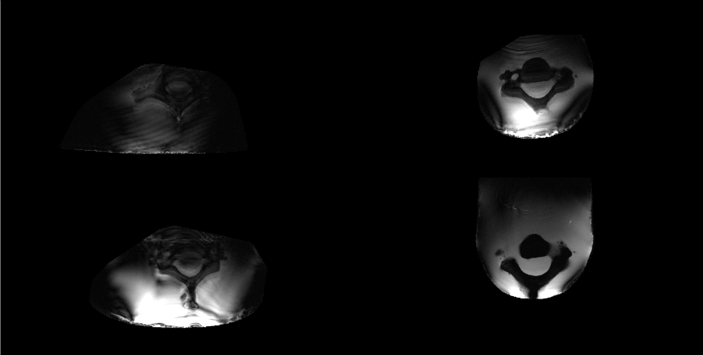
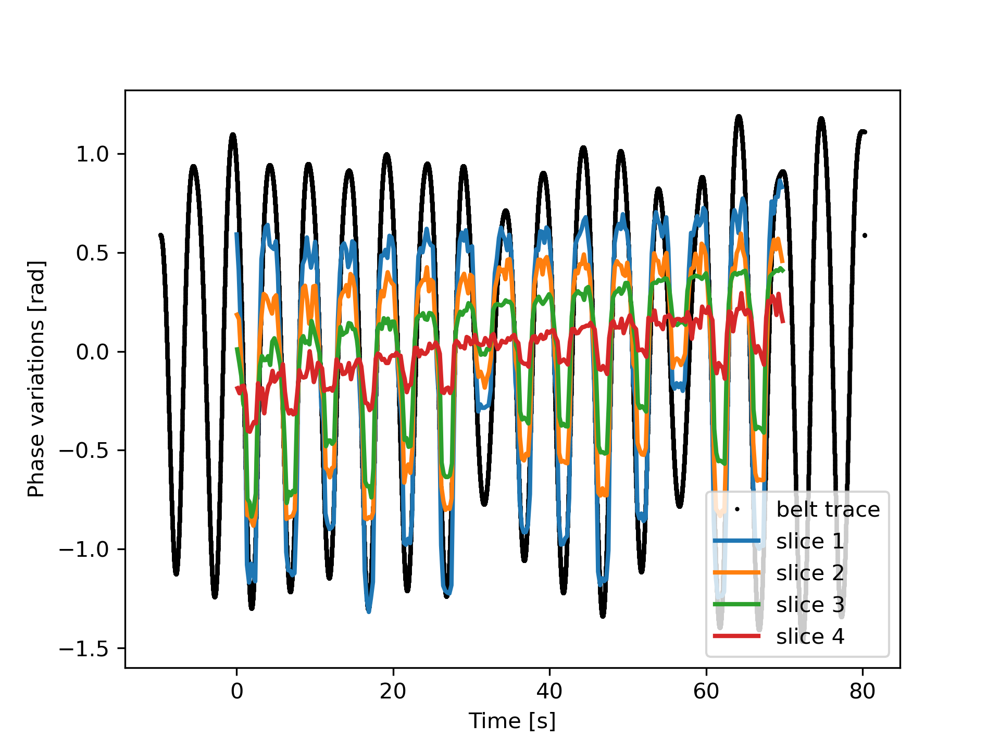

[](https://NordicMRspine.github.io/MRINavigator.jl/dev)


# UserExample_MRINavigator
This folder contains example scripts for the [MRINavigator.jl](https://github.com/NordicMRspine/MRINavigator.jl) package. The package documentation can be found [here](https://NordicMRspine.github.io/MRINavigator.jl/dev). The example scripts have been tested on Julia v1.10.2 and MRINavigator v0.1.1.

An example dataset acquired on a phantom can be downloaded [here](https://doi.org/10.5281/zenodo.10731729). When the download is complete extract to your local folder.

## Instantiation step
To use some package functionalities, external software are required. Specifically: [Spinal Cord Toolbox](https://spinalcordtoolbox.com/stable/) and [FSLeyes](https://open.win.ox.ac.uk/pages/fsl/fsleyes/fsleyes/userdoc/install.html).

The example data consists of a folder named **sub01** containing the files and folder structure needed to run the example scripts. This can be installed in any parent directory of your choice.

This example scripts directory also needs to be installed in a location of your choice. There are two main options to do this:
1. Open a terminal or command prompt and navigate to the desired directory, then clone the repository using Git:
    ```
    git clone https://github.com/NordicMRspine/UserExample_MRINavigator.git
    ```
2. Click the green **Code** button at the top right of this webpage, then select **Download ZIP**. Once the download is completed extract its contents into your desired directory.

Before running the script open the **config.jl** file and insert the path of the parent directory of the example data in line 14 (assigning it to `params[:root_path]`). Add the folder separation symbol (`/` for macOS/Linux or `\` for Windows) at the end of the path. This indicates that the path refers to a folder and not a file.

The scripts can be run now.

## Example results
The following example results can be obtained running the user example scripts contained in this folder on the available [phantom data](https://doi.org/10.5281/zenodo.10731729).
1. Images reconstructed without navigator correction (`params[:corr_type] = "none"` in the [parameters dictionary](https://nordicmrspine.github.io/MRINavigator.jl/dev/GettingStarted/#The-parameters-dictionary)).



2. Images reconstructed after applying the [FFT_unwrap](https://nordicmrspine.github.io/MRINavigator.jl/dev/Pipelines/) navigator correction (`params[:corr_type] = "FFT_unwrap"`).


3. Navigator phase estimates for different slices obtained with the FFT_unwrap approach, displayed with the simulated respiratory belt recording.



## Acknowledgement
The authors thank the ISMRM Reproducible Research Study Group for conducting a code review of the code (package version 0.1.1). The scope of the code review covered only the code’s ease of download, quality of documentation, and ability to run, but did not consider scientific accuracy or code efficiency.